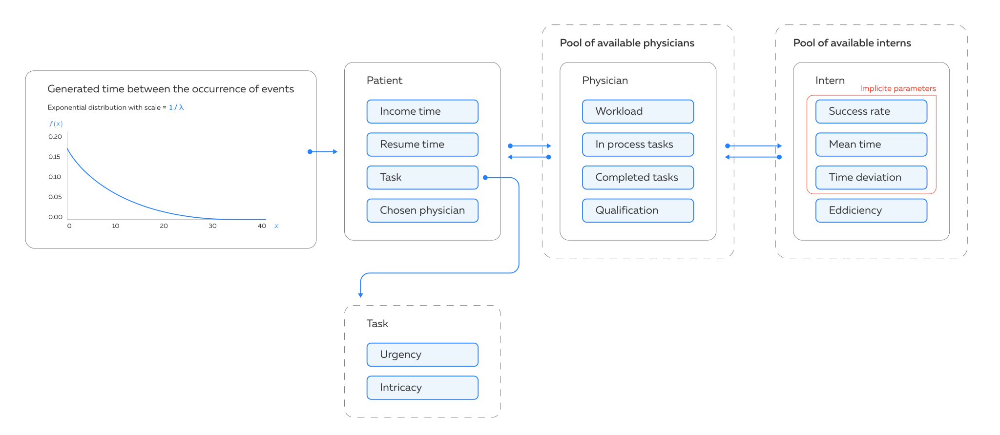

# RTX-BDI-MAS Simulator

The general structure of the modelling process is outlined below. We use an exponential distribution with a scale of 6 (1/lambda) to generate the time between occurring events. An event is the appearance of a patient, which is characterised by several parameters: the time of the request appearance, the time of service provision, the task assigned and the selected doctor. A task is a certain MRI image to be decoded. The task, like the patient, is a named entity and has the following parameters: urgency and complexity. Urgency can take values from 1 to 3, where 1 is an urgent task (hospitalisation, severe condition), 2 is a task of medium urgency (the patient is conscious, injuries of no more than medium severity), 3 is the lowest priority (regular examinations, monitoring, minor injuries). Complexity is evaluated by a binary variable, either the task requires the highest qualification of a specialist or it does not. Complexity is a linear combination of technical complexity in image processing and urgency of the task. Thus, even tasks with the lowest priority can be considered as complex if they require more than usual processing time.

